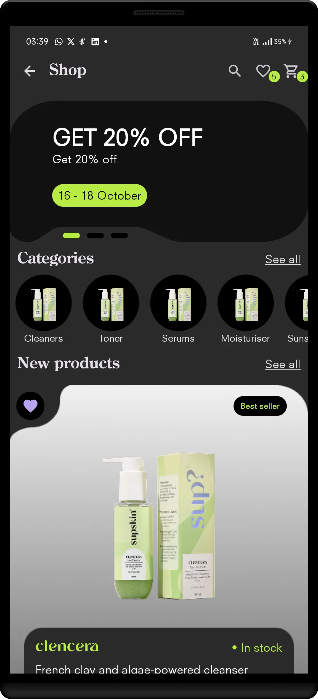
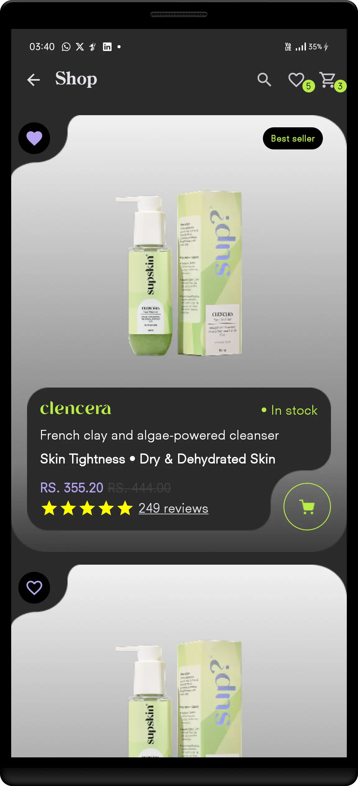
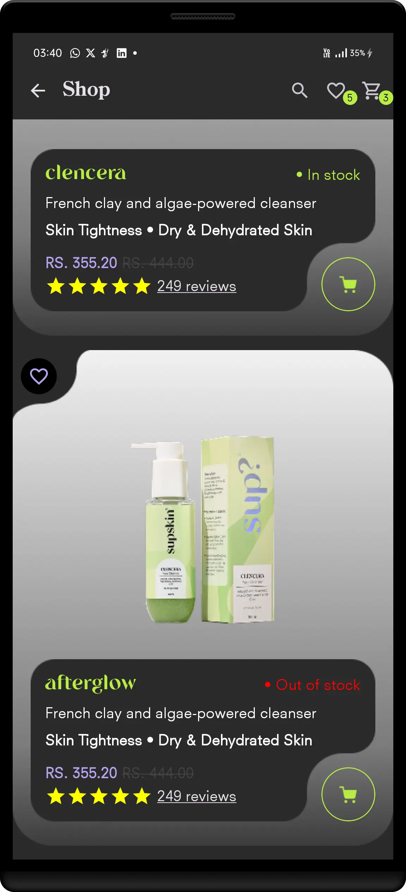

# 🛍️ Shop - Jetpack UI

An Android Jetpack Compose shopping single screen app UI built for a practical task.

## 📱 Features

- Elegant dark theme shopping UI
- Offer Slider
- Horizontal category
- Vertical product list with ratings and cart button
- Modular Jetpack Compose structure

## 🧱 Built With

- Android Jetpack Compose
- Kotlin
- Material 3
- MVC-ready project structure

## 📂 Folder Structure

```
app/
    └── MainActivity.kt
    ├── ui/
        └── Theme
    ├── components/
    └── model/
```

## 🚀 Getting Started

1. Clone this repo:

    ```
    git clone https://github.com/PremDanej/Shop-Practical-Task.git
    ```


2. Open in Android Studio.

3. Build and run!

## 🖼️ Screenshots

|                                       Main Screen                                        |                                       Screen pt 2                                        |                                       Screen pt 3                                       |
|:----------------------------------------------------------------------------------------:|:----------------------------------------------------------------------------------------:|:---------------------------------------------------------------------------------------:|
|  |  |  |

| Task Recording                                                                                            |
|-----------------------------------------------------------------------------------------------------------|
| <video width="560" height="315" controls>  <source src="\images\recording.mp4" type="video/mp4"> </video> |